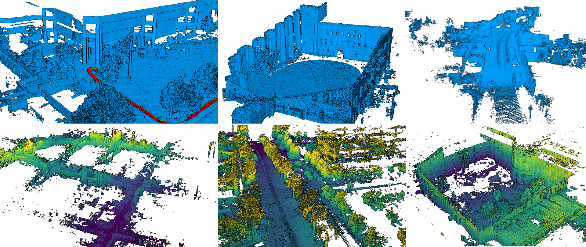
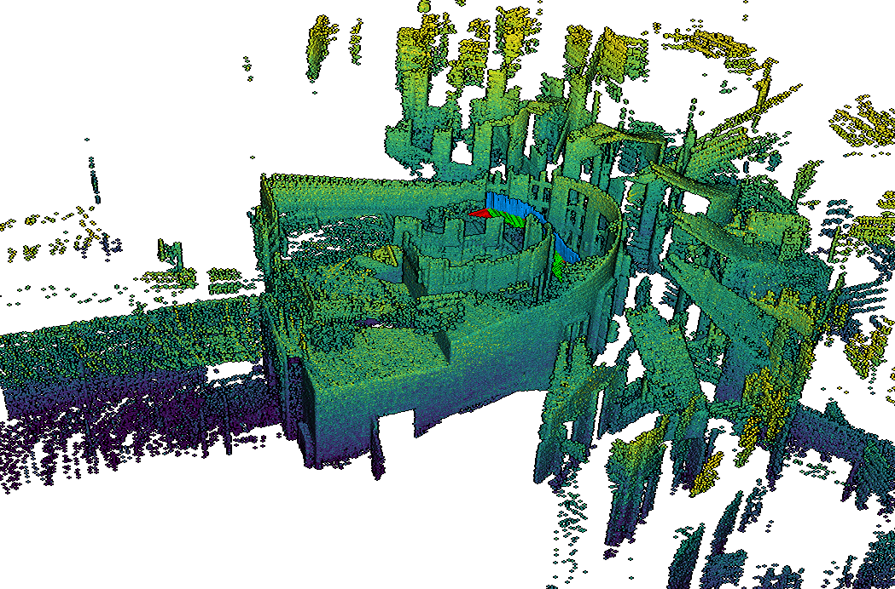

# pyLiDAR-SLAM

This codebase proposes modular light python and pytorch implementations of several LiDAR Odometry methods, 
which can easily be evaluated and compared on a set of public Datasets.

It heavily relies on [omegaconf](https://omegaconf.readthedocs.io/en/2.0_branch/) and [hydra](https://hydra.cc/), 
which allows us to easily test the different modules and parameters with few but structured configuration files.


This is a research project provided "as-is" without garanties, 
use at your own risk. It is actively used for **[Kitware Vision team](https://www.kitware.fr/equipe-vision-par-odinateur/)** internal research thus is likely to be heavily extended, 
rewritten (and hopefully improved) in a near future.


## Overview



*pyLIDAR-SLAM* is designed to be modular, multiple components are implemented at each stage of the pipeline.
Its modularity can make it a bit complicated to use. We provide this [wiki](https://github.com/Kitware/pyLiDAR-SLAM/wiki) to help you navigate it.
If you have any questions, do not hesitate raising issues.

The documentation is organised as follows:

- [`INSTALLATION:`](https://github.com/Kitware/pyLiDAR-SLAM/wiki/INSTALLATION) Describes how to install pyLiDAR-SLAM and its different components
- [`DATASETS:`](https://github.com/Kitware/pyLiDAR-SLAM/wiki/DATASETS) Describes the different datasets integrated in pyLiDAR-SLAM, and how to install them
- [`TOOLBOX:`](https://github.com/Kitware/pyLiDAR-SLAM/wiki/SLAM-LiDAR-Toolbox) Describes the contents of the toolbox and the different modules proposed
- [`BENCHMARK:`](https://github.com/Kitware/pyLiDAR-SLAM/wiki/Benchmark) Describes the benchmarks supported in the Dataset **/!\ Note:** This section is still in construction

The goal for the future is to gradually add functionalities to pyLIDAR-SLAM (Loop Closure, Motion Segmentation, Multi-Sensors, etc...).

## News

> **[08/10/2021]:** We also introduce support for individual rosbags (Introducing naturally an overhead compared to using ROS directly, but provides the flexibility of pyLiDAR-SLAM)
>
> **[08/10/2021]:** We release code for Loop Closure with **pyLiDAR-SLAM** accompanied with a simple **PoseGraph** Optimization.
>
> **[08/10/2021]:** We release our [new work](https://arxiv.org/abs/2109.12979) on arXiv. It proposes a new state-of-the-art pure LiDAR odometry implemented in C++ (check the [project](https://github.com/jedeschaud/ct_icp) main page). python wrappings are available, and it can be used with **pyLiDAR-SLAM**.

## Installation 

See the wiki page [INSTALLATION](https://github.com/Kitware/pyLiDAR-SLAM/wiki/INSTALLATION) for instruction to install the code base and the modules you are interested in. 

### DATASETS

*pyLIDAR-SLAM* incorporates different datasets, see [DATASETS](https://github.com/Kitware/pyLiDAR-SLAM/wiki/DATASETS)  for installation and setup instructions for each of these datasets.
Only the datasets implemented in *pyLIDAR-SLAM* are compatible with hydra's mode and the scripts `run.py` and `train.py`. 

But you can define your own datasets by extending the class [`DatasetLoader`](slam/dataset/dataset.py).

**New:** We support individual rosbags (without requiring a complete ROS installation). See the minimal example for more details.


## A Minimal Example

> Download a rosbag (e.g. From  Rosbag Cartographer):
[example_rosbag](https://storage.googleapis.com/cartographer-public-data/bags/backpack_3d/with_intensities/b3-2016-04-05-15-51-36.bag)
>
> **Note:** You need the `rosbag` python module installed to run this example (see [INSTALLATION](https://github.com/Kitware/pyLiDAR-SLAM/wiki/INSTALLATION) for instructions)

> Launch the SLAM:

```
python3 run.py num_workers=1 /          # The number of process workers to load the dataset (should be at most 1 for a rosbag)
    slam/initialization=NI /            # The initialization considered (NI=No Initialization / CV=Constant Velocity, etc...)
    slam/preprocessing=grid_sample /    # Preprocessing on the point clouds
    slam/odometry=icp_odometry /        # The Odometry algorithm
    slam.odometry.viz_debug=True /      # Whether to launch the visualization of the odometry
    slam/loop_closure=none /            # The loop closure algorithm selected (none by default)
    slam/backend=none /                 # The backend algorithm (none by default)
    dataset=rosbag /                    # The dataset selected (a simple rosbag here)
    dataset.main_topic=horizontal_laser_3d /    # The pointcloud topic of the rosbag 
    dataset.accumulate_scans=True /             # Whether to accumulate multiple messages (a sensor can return multiple scans lines or an accumulation of scans) 
    dataset.file_path=<path_to_rosbag_dir>/b3-2016-04-05-15-51-36.bag / #  The path to the rosbag file 
    hydra.run.dir=.outputs/TEST_DOC   #  The log directory where the trajectory will be saved
```

> This will output the trajectory, log files (including the full config) on disk at location `.outputs/TEST_DOC`.
> 
> Our minimal LiDAR Odometry, is actually a naïve baseline implementation, which is mostly designed and tested on driving datasets (see the KITTI benchmark). 
> Thus in many cases it will fail, be imprecise or too slow. 
> 
> We recommend you install the module `pyct_icp` from [our recent work](https://github.com/jedeschaud/ct_icp), which provides a much more versatile and precise LiDAR-Odometry.
>
> See [the wiki page INSTALLATION](https://github.com/Kitware/pyLiDAR-SLAM/wiki/INSTALLATION) for more details on how to install the different modules. 
> If you want to visualize in real time the quality of the SLAM, consider also installing the module `pyviz3d`.

> Once `pyct_icp` is installed, you can modify the command line above: 
```
python3 run.py num_workers=1 /          
    slam/initialization=NI /            
    slam/preprocessing=none /    
    slam/odometry=ct_icp_robust_shaky / # The CT-ICP algorithm for shaky robot sensor (here it is for a backpack) 
    slam.odometry.viz_debug=True /      
    slam/loop_closure=none /            
    slam/backend=none /                 
    dataset=rosbag /                    
    dataset.main_topic=horizontal_laser_3d /    
    dataset.accumulate_scans=True /             
    dataset.file_path=<path_to_rosbag_dir>/b3-2016-04-05-15-51-36.bag / 
    hydra.run.dir=.outputs/TEST_DOC   
```

> It will launch pyct_icp on the same rosbag (running much faster than our python based odometry)
>
> With `pyviz3d` you should see the following reconstruction (obtained by a backpack mounting the stairs of a museum): 




## More advanced examples / Motivation

> **pyLiDAR-SLAM** will progressively include more and more modules, to build more powerful and more accessible LiDAR odometries.
>
> For a more detailed / advanced usage of the toolbox please refer to our documentation in the wiki [HOME](https://github.com/Kitware/pyLiDAR-SLAM/wiki/HOME).

> The motivation behind the toolbox, is really to compare different modules, **hydra** is very useful for this purpose.
>
> For example the script below launches consecutively the `pyct_icp` and `icp_odometry` odometries on the same datasets. 

```
python3 run.py -m /             # We specify the -m option to tell hydra to perform a sweep (or grid search on the given arguments)
    num_workers=1 /          
    slam/initialization=NI /            
    slam/preprocessing=none /    
    slam/odometry=ct_icp_robust_shaky, icp_odometry /   # The two parameters of the grid search: two different odometries
    slam.odometry.viz_debug=True /      
    slam/loop_closure=none /            
    slam/backend=none /                 
    dataset=rosbag /                    
    dataset.main_topic=horizontal_laser_3d /    
    dataset.accumulate_scans=True /             
    dataset.file_path=<path_to_rosbag_dir>/b3-2016-04-05-15-51-36.bag / 
    hydra.run.dir=.outputs/TEST_DOC   
```

#### Benchmarks

We use this functionality of *pyLIDAR-SLAM* to compare the performances of its different modules on different datasets.
In [Benchmark](https://github.com/Kitware/pyLiDAR-SLAM/wiki/Benchmark) we present the results of *pyLIDAR-SLAM* on the most popular open-source datasets. 

Note this work in still in construction, and we aim to improve it and make it more extensive in the future.


#### Research results

> Small improvements will be regularly made to `pyLiDAR-SLAM`, However *major changes / new modules* will more likely be introduced along research articles (which we aim to integrate with this project in the future)
>
> Please check [RESEARCH](https://github.com/Kitware/pyLiDAR-SLAM/wiki/RESEARCH) to see the research papers associated to this work. 


### System Tested

| OS            | CUDA   | pytorch  | python | hydra |
| --- | --- | --- | --- | --- |
| Ubuntu 18.04  | 10.2   | 1.7.1    | 3.8.8 | 1.0 |

### Author
This is a work realised in the context of Pierre Dellenbach PhD thesis under supervision of [Bastien Jacquet](https://www.linkedin.com/in/bastienjacquet/?originalSubdomain=fr) ([Kitware](https://www.kitware.com/computer-vision/)), 
Jean-Emmanuel Deschaud & François Goulette (Mines ParisTech).

### Cite

If you use this work for your research, consider citing:

```
@misc{dellenbach2021s,
      title={What's in My LiDAR Odometry Toolbox?},
      author={Pierre Dellenbach, 
      Jean-Emmanuel Deschaud, 
      Bastien Jacquet,
      François Goulette},
      year={2021},
}
```
