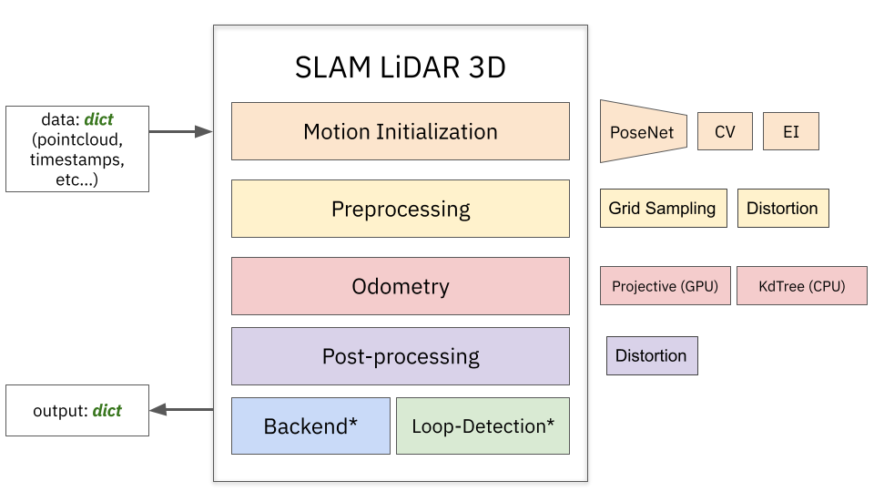
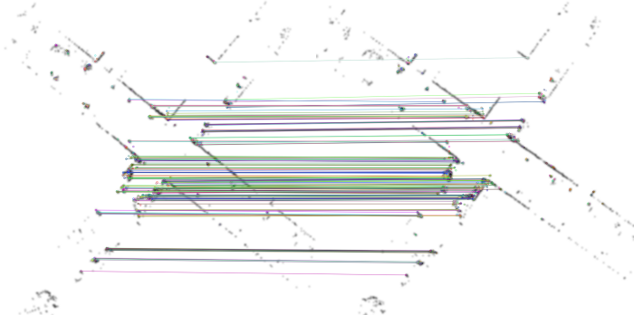

# SLAM LiDAR Toolbox



>This page describes in depth the content of the project. **pyLIDAR-SLAM** is designed as a modular toolbox of interchangeable pieces.
The basic structure of a **SLAM** algorithm is presented in the figure above.
For each component, multiple algorithms are implemented, (more will be added in the future). 

>Using Hydra, custom SLAM pipelines can be defined simply by modifying a command line argument. 
>Note that it leads to lengthy command lines (see the [benchmark](benchmark.md) to have an idea), but it is always possible to use pyLIDAR-SLAM as a library in your own scripts.


> A **SLAM** in this project processes data *frame-by-frame*. At each time step, the data is passed to the **SLAM** in a python dictionary.
>The key mappings are typically resolved using the configuration. See [slam.py](../slam/slam.py) for reference. 

> The script [`run.py`](../run.py) launches the **SLAM** specified by the configuration on a set of sequences of a given dataset see [dataset.md](datasets.md) for a list of the available datasets and how to install them. 

> Below, we review component by component all the modules implemented in **pyLIDAR-SLAM**.

# Motion Initialization

> The initialization of the motion is very important for LiDAR Odometries. Indeed, most lidar odometries rely on a variant of the ICP which has a very small convergence region.
> The strategies proposed are the following:
> - **CV** (for constant velocity): the motion estimated is the same as the previous motion between two frames.
> - **PoseNet**: the motion is predicted using a CNN based pose regression.
> - **EI** (for Elevation Images): the motion is predicted using a 2D image feature based registration.
> - **NI** (for No Initialization)

> To select the initialization module, pass in argument `slam/odometry/initialization=<init_name>` where `init_name` is one of `CV,EI,PoseNet,NI`.

> All initialization models can be found in [preprocessing.py](../slam/odometry/preprocessing.py).
#### Constant Velocity
> This model is typically the default model for a LiDAR mounted on a car (which has enough inertia for this model to hold).
> For other acquisition methods (hand-held or mounted on a segway or a drone which lead to abrupt rotations, this might not be a good enough model)

- **Command arguments**: `slam/odometry/initialization=CV`

#### Elevation Images
> The relative motion of a sensor is often strictly planar. Our **Elevation Images** based initializes the motion by estimating this 2D motion using Image Registration.
> Pointclouds are projected into elevation images. A 2D rotation and translation is robustly fitted, and is used to initialize the 3D motion. 



> Very useful for a dataset such as **NCLT** (which has abrupt *yaw* rotations)

> **Limits**:
> for this method to work, it requires that the sensor is mounted parallel to the ground on which the robot moves. It is also not robust to strong *pitch/roll* orientation changes. 

> **Note:** This method requires the OpenCV package `cv2` to be installed (e.g. via `pip install opencv-python`).
>
- **Command arguments**: `slam/odometry/initialization=EI` (to visualize the 2D alignments with opencv :`slam.odometry.initialization.debug=true`)

> See [`EIConfig`](../slam/odometry/preprocessing.py) and [`ElevationImageRegistration`](../slam/common/registration.py) for more details on the configuration options.

#### PoseNet

> **PoseNet** (for **RPR** (Relative Pose Regression) is a convolutional regressor predicting the 6 parameters of relative pose pose between two frames.

> The implementation can be found in [prediction_modules.py](../slam/training/prediction_modules.py). **PoseNet** needs to be trained on a Dataset (KITTI for instance). 
> The saved model will be loaded by the initialization algorithm which will regress at each step a relative pose between two consecutive frames.

> Follow the instruction below to launch the training of PoseNet:

 - Launch the train command (for example):
```bash 
export DATASET=kitti
export JOB_NAME=train_posenet
export KITTI_ODOM_ROOT=<path-to-kitti-odometry-root-directory>     # The path to KITTI odometry benchmark files
export TRAIN_DIR=<absolute-path-to-the-desired-train-dir>          # Path to the output models 

# Launches the Training of PoseNet
python train.py +device=cuda:0 +num_workers=4 +num_epochs=100 dataset=kitti
```
> Note: This will typically take a night for training on KITTI.
 - Define the environment variable `TRAIN_DIR` pointing to the directory containing the `checkpoint.ckp` file containing the trained model parameters.
```bash 
export DATASET=kitti
export JOB_NAME=slam_with_posenet
export KITTI_ODOM_ROOT=<path-to-kitti-odometry-root-directory>     # The path to KITTI odometry benchmark files
export TRAIN_DIR=<absolute-path-to-the-desired-train-dir>          # Path to the output models 

# Launches the Training of PoseNet
python run.py +device=cuda:0 +num_workers=4 dataset=kitti slam/odometry/initialization=PoseNet
```

> See our paper [What's In My LiDAR Odometry Toolbox](https://arxiv.org/abs/2103.09708) for an in depth discussion of the relevance/interest of PoseNet. To summarize: beware of its lack of generalization capacities.

# Preprocessing
> Preprocessing in pyLiDAR-SLAM is implemented as a set of filters. Each filter is applied consecutively to the input frame dictionary.

> The preprocessing modules currently implemented are:
> - **cv_distortion**: applies an initial distortion of the frame following the constant velocity assumption (uses timestamps and the initial pose predicted)
> - **voxelization**: voxelize a frame computes the voxel statistics mean/covariance
> - **grid_sampling**: select a point by voxel for a selected voxel size

>

# Odometry

# Post-processing

# Loop Closure (*Under Development)


